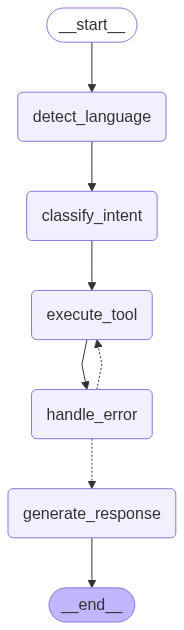

# Nha Trang Travel Chatbot

A conversational AI assistant for travel information about Nha Trang, Vietnam. This project combines retrieval-augmented generation (RAG), hybrid search (BM25 + embeddings), and streaming chat UI.

## Features

- Conversational chatbot for Nha Trang tourism
- Hybrid document retrieval (BM25 + Chroma vector search)
- Real-time web search and Google Maps integration
- Streaming responses via FastAPI backend
- Basic modern Streamlit-based chat UI

## Project Structure

```
.
├── chat_ui.py                # Streamlit UI for chat
├── config.py                 # Configuration and constants
├── src/
│   ├── api/                  # FastAPI backend
│   └── rag/                  # RAG, agent, embedder, chunker
├── data/                     # Data and vector stores
├── tests/                    # Unit tests
└── requirements.txt          # Python dependencies
```

## Getting Started

### 0. (Recommended) Create and activate a virtual environment

```sh
python -m venv .venv
# On Windows:
.venv\Scripts\activate
# On macOS/Linux:
source .venv/bin/activate
```

### 0.5. Setup environment variables
Copy the example environment file and edit as needed:
```sh
cp .env.example .env
```
Edit `.env` to set your API keys.

### 1. Install dependencies

```sh
pip install -r requirements.txt
```

### 2. Prepare data

- Place your markdown documents in `data/raw/`
- Run the document chunker to preprocess and split documents

### 3. Build the index

```sh
python -m src.rag.embedder
```

### 4. Start the API server

```sh
uvicorn src.api.main:app --reload
```

### 5. Launch the chat UI

```sh
streamlit run chat_ui.py
```

## Configuration

See [`config.py`](config.py) for directory paths, model names, and other settings.

## API Endpoints

- `POST /chat` — Stream chat responses
- `GET /history` — Get chat history
- `DELETE /history` — Clear chat history

## Concepts

### Retrieval-Augmented Generation (RAG)

RAG is a technique that combines information retrieval with generative AI. Instead of relying solely on the language model's internal knowledge, it retrieves relevant documents from an external knowledge base and uses them as context for the model to generate more accurate, up-to-date, and grounded answers.


### Hybrid Search

In this project, I combine **BM25 search** and **embedding-based vector search** to retrieve relevant documents. The combined score for each document is calculated with:

```
bm25_weight * (1 / rank_bm25) + emb_weight * (1 / rank_emb)
```

* **BM25 Search**: A traditional keyword-based retrieval algorithm that ranks documents based on term frequency and inverse document frequency. It works well for exact and sparse keyword matches.
* **Embedding (Vector) Search**: Converts text into dense vector representations using embeddings. It retrieves documents based on semantic similarity using vector distance metrics.

This hybrid approach balances keyword precision and semantic relevance.


### Cross-Encoder Reranking

After retrieving candidate documents using hybrid search, the system uses a **cross-encoder reranker** to further improve answer quality. The cross-encoder model takes each candidate document and the query as input and scores their relevance using deep neural attention over both texts. The top-ranked documents are then used as context for the final answer generation.

This reranking step helps ensure that the most contextually relevant and semantically accurate information is provided to the user, even if the initial retrieval step returns noisy or loosely related results.


### RAG Pipeline Implementation

The conversational assistant follows this flow:

1. **User Query**

2. **Detect Language**

3. **Classify Intention**: Decide whether the query aims to:

   * **Retrieve travel info**
   * **Search general web info**
   * **Get a location**

4. **Execute Tool Based on Intention**:

   * **Retrieve**: Translate query to Vietnamese, then retrieve documents using hybrid search.
   * **Search**: Transform query for better web search, then use Tavily API.
   * **Get Location**: Transform query to extract location info, then query Google Maps API.

5. **Error Handling & Fallback**:

   * If **retrieve** or **get location** fails → fallback to **search**
   * If **search** fails → raise error and stop.

6. **Generate Final Answer**: Use retrieved or searched context to generate a response.
\n\n

<p align="center">
  
</p>

### Streaming Response vs Full Response Graph

Implemented two graph variations using **LangGraph**:

- **Full Response Graph**:
  Conditional edge for error handling before final generation:

  ```python
  graph.add_conditional_edges(
      "handle_error",
      lambda s: "generate_response" if not s["error"] or s["intent"] == "search" else "execute_tool",
      {"generate_response": "generate_response", "execute_tool": "execute_tool"}
  )
  ```

- **Streaming Response Graph**:
  Skip LLM generation logic inside the graph. Terminate after error handling — streaming handled separately outside:

  ```python
  graph.add_edge("handle_error", END)
  ```


### Memory & Conversation History

The assistant maintains short-term memory using:

**ConversationBufferWindowMemory (k=5)**
This keeps the last 5 interactions for context continuity within the session.


## Customization

- To add new data, place markdown files in `data/raw/` and re-run the chunker/indexer.
- To change models, update settings in [`config.py`](config.py).

## Contributing

Pull requests and issues are welcome!

## License

This project is licensed under the MIT License.
